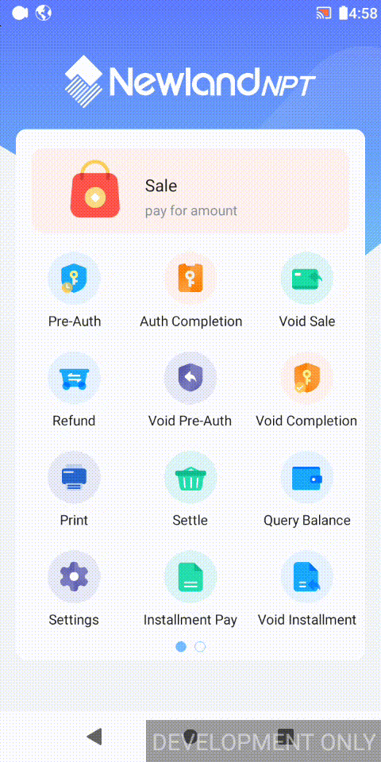

# BankTemplate

 A bank template project with a good development framework. It is based on Newland SDK and implements various financial transactions.


## Demo

 **[demo.apk](readme/NSDK_BANKTEMPLATE-39-3.9-RELEASE-202310121001.apk)** is the **BankTemplate**，and  **[platform.apk](readme/ST-PLATFORM_20001_NPI_AN_2.00.01_DEBUG_20221129_signed.apk)** is a local simulation platform. Through these two apk, simulated transactions can be executed on the **development POS**.

Operation: Simulation app-> (Service is open) Configure->Save->Dialog OK.  Then, the transaction can be perform on BankTemplate.

> Note: The simulation platform apk can only be performed on the development POS.



## Gradle and Environment

| Android Studio   | Gradle Plugin Version | Gradle Version | Android SDK |
| ---------------- | --------------------- | -------------- | ----------- |
| 2022.2.1 Patch 2 | 8.0.2                 | 8.0            | 33          |

If an error occurs when opening the project, please upgrade Gradle to the latest version. (**Android Studio->Help->Check Updates**)

In order to facilitate project development, **BankTemplate** gradle makes some modifications. There are following differences from native :

- SDK version
- libraries dependencies
- generated APK name
- signing configs
- namespace  (Formerly **package** of AndroidManifest.xml)

For specific content, please see **[Gradle Configuration](readme/Gradle Configuration.md)** .

## UI

**BankTemplate** developed the basic themes, element colors, and sizes. 

It customizes common views and components, and used multiple Lottie animations, adapts to different screens.

For specific content, please see [UI](./readme/UI.md) .

## Logical Flows

When you click **BankTemplate** on the launcher. the application will process according to the following process:

[App](./app/src/main/java/acquire/app/App.java) is invoked.  `App` will Initialize the app basic parameters. The step is on a single thread and it won't affect the UI process. The parameters is the first half of the parameters that the application needs to initialize. 

```java
//init data in Application
public class App extends BaseApplication {
    @Override
    public void onCreate() {
      	...
         BaseApplication.SINGLE_EXECUTOR.execute(() -> {
            SelfCheckHelper.initAppConfig(this);
        });
    }
}
```

Then, [MainActivity](./app/src/main/java/acquire/app/MainActivity.java) will be launch. It will initialize the last parameters on the same single  thread as `App`. Because this can make the initialization of parameters execute in an orderly manner.  All screens of  **BankTemplate**'' are  implemented inside a `Fragment`.  

```java
public class MainActivity extends BaseActivity {
    @Override
    protected void onCreate(Bundle savedInstanceState) {
        super.onCreate(savedInstanceState);
       	...
        BaseApplication.SINGLE_EXECUTOR.execute(() -> {
            SelfCheckHelper.initDevice(this);
            ...
            mSupportDelegate.switchContent(MainFragment.newInstance());
        });
        ...
    }
}
```

So the  [MainFragment](./app/src/main/java/acquire/app/fragment/main/MainFragment.java) be open to show the main menu by `MainActivity`. `MainFragment` has a ViewPager to show [MenuFragment](./app/src/main/java/acquire/app/fragment/main/MenuFragment.java). `MenuFragment` includes the main menu. If a screen can't display all menu items, you can swipe the screen to the next screen or enter a  [SubMenuFragment](./app/src/main/java/acquire/app/fragment/main/SubMenuFragment.java).  About main menu, you can see [UI](./readme/UI.md) .

```java
public class MainFragment extends BaseFragment {
   ...
    private void initView() {
       ...
        List<MenuFragment> childFragments = createMenuFragments(items.subList(1, items.size()));
        binding.viewPager.setAdapter(new FragmentStateAdapter(this) {
            @NonNull
            @Override
            public Fragment createFragment(int position) {
                return childFragments.get(position);
            }

            @Override
            public int getItemCount() {
                return childFragments.size();
            }
        });
        ...
    }
	...
    @Override
    public void onResume() {
        super.onResume();
        if (MainMenu.getInstance().isChanged()) {
            initView();
        }
    }
}
```

[TransActivity](./core/src/main/java/acquire/core/TransActivity.java) will be open when the main item is clicked. And then, `TransActivity` will start the transaction.

```java
public class TransActivity extends BaseActivity {
	...
    private void transact() {
        ...
        AbstractTrans trans;
        try {
            Class<? extends AbstractTrans> clz = TransUtils.getTrans(pubBean.getTransType());
            if (clz == null) {
                LoggerUtils.e("Transaction class is null.");
                intent.putExtra(TransTag.MESSAGE, getString(R.string.core_transaction_result_no_such_trans));
                intent.putExtra(TransTag.RESULT_CODE, ResultCode.FL);
                setResult(RESULT_CANCELED, intent);
                finish();
                return;
            }
            LoggerUtils.d("Instantiate transaction: " + clz);
            trans = clz.newInstance();
        } catch (IllegalAccessException | InstantiationException e) {
            ...
            finish();
            return;
        }
        ...
        trans.init(this, pubBean);
        trans.transact((success) -> {
            ...
            finish();
        });
    }
	...
}
```


## Transactions

Each transaction processing is controlled by a transaction class. The transaction class  will be invoked when `TransActivity` starts, and `TransActivity`  will finish after the transaction class completing.

For specific content, please see [Transactions](./readme/Transactions.md) 


## Application Settings

[Settings](./core/src/main/java/acquire/core/trans/impl/settings/Settings.java) is a transaction used for application settings. When `Settings` executes, it will start the [SettingsActivity](./settings/src/main/java/acquire/settings/SettingsActivity.java).

`SettingsActivity` requires the password. There are two passwords for different settings.

- 201003 -> vendor settings. This password is fixed in codes. Vendor settings are used for emergency handling.
- 000000-> admin/merchant settings. This password can be  modified in settings  or via `core/src/main/asset/default_params.ini`. This settings are used for merchant configure.


## Newland SDK

BankTemplate encapsulates all api related to SDK libraries in the [sdk_helper](./sdk_helper) module.

It includes the following SDK:

- [NSDK](./readme/NSDK.md): includes built-in and external SDK libraries .
- [EMV](./readme/EMV.md): handles the EMV process.
- [TOMS API](./readme/TOMS API.md): includes FlyReceipt and FlyParameters service api.
- [RKL](./readme/RKL.md):  is a RKI library.
- [Wireless Dock](./readme/Wireless Dock.md):  can bind accessories by the dock box.


## ISO8583

[ISO8583.md](./readme/ISO8583.md) introduces how to pack the 8583 data.

